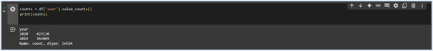
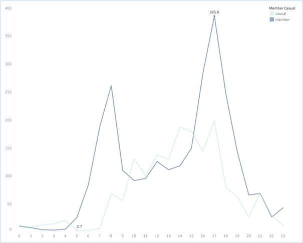

# Google Data Analytics Capstone: Case Study
Cyclistic Bike Share Users Analysis
Getting insights for data-driven decisions on Casual Riders vs Subscribed Members

## Data Source
- Divvy_Trips_2019_Q1 (Cyclistic): [Data_Q12019](https://docs.google.com/spreadsheets/d/11NucGhJPi0EaO5XEG33z-j8sUttz_k64LZrDgvye2XA/edit?gid=1797029090#gid=1797029090)

- Divvy_Trips_2020_Q1 (Cyclistic): [Data_Q12020](https://docs.google.com/spreadsheets/d/1kuEWrjmpDwPv4t7hdRbThluGAENW_rwauXYYJS1AfzA/edit?gid=640449855#gid=640449855)

## Visualisation
Tableau Dashboard can be found [here](https://public.tableau.com/app/profile/douglas.moreira/viz/Draft_17566352104110/Dashboard1) 

## Introduction
This study examines how annual members, and casual riders use Cyclistic bikes, aiming to uncover patterns that can inform strategies to convert casual users into subscribed members. The analysis is based on data from over 5,800 bikes and 600 docking stations across multiple locations, covering the period from 2019 to 2020. It focuses on ride durations across different times of day and user types, with inaccurate data removed to maintain quality. By comparing behaviours across time periods, the study highlights key differences that can support membership growth.

## Cyclistic Business Model Overview
Since 2016, Cyclistic’s mission has been to support public transport users by providing adaptable bikes through its bike share program. Options include reclining bikes, hand tricycles, and cargo bikes, designed for people with disabilities and those who do not use standard two-wheeled bikes.
Commuting used to be enjoyable. Cyclistic aims to bring that experience back by helping users reconnect with city spaces. Whether commuting or riding for leisure, our membership options meet a range of needs.
Notice your surroundings. You might see a new side of a building you've passed before. Ever thought, “How have I never seen this park on my way to work?” Or maybe you stop to look at a flower along the path. Move, get outdoors, connect, and enjoy the ride.
### Key Tasks
The main task for the business is to gain a clear understanding of how to grow its membership customer portfolio. This aims to increase profits for operations, reinvestment, or expansion. Converting more customers to annual members requires defining usage habits and customer profiles to build a clear target for action. This comes down to knowing your customer better to offer services that match their needs.

### Key Preliminary Steps
- Download and store data securely
- Review file structure and organisation
- Sort and filter data in RStudio
- Confirm data credibility and integrity

### Key stakeholders include
- Cyclistic executive team and other business strategy decision-makers
- Director of Marketing Lily Moreno
- Cyclistic Marketing Analytics Team
- Cyclistic customers

### Data Overview
- Data location: Stored locally on a secure drive
- Data format: Two Excel .csv files
- Organisation: Data has been uploaded to RStudio, sorted, and filtered
- Credibility: No issues found. Data meets ROCCC standards (Reliable, Original, Comprehensive, Current, and Cited)
- Licensing, privacy, security, accessibility: Data is public and authorised for use
- Integrity check: Files are not corrupted
- Relevance: Data supports the business questions
- Issues: No problems identified

### Deliverable
Data Sources Used: Two .csv files containing bike ride data for Q1 of 2019 and 2020.

### Technologies and Tools Used in This Project
- Data Preparation: Excel
- Data Cleaning: R (Posit’s RStudio) and Python (Google Colab)
- Data Analysis: R (Posit’s RStudio) and SQL (Google BigQuery)
- Data Visualisation: Tableau
- Version Control: Git, GitHub
- Terminal: Git Bash, Visual Studio Code

## Analysis Methodology
- **Google Data Analytics Phases**
This study uses the Google Data Analytics process as a framework for analysis. This approach involves six key phases that provide a method for extracting insights and value from data. 
The six steps in Google Data Analytics are: Ask, Prepare, Process, Analyse, Share, and Act.

*Sources: https://grow.google/grow-your-career/articles/what-is-data-analytics/ and https://emkautsar.medium.com/data-analysis-phases-7f32b575b431*

## Ask
The insights gathered will support data-driven decisions, helping the business identify key usage patterns between casual and annual members. With this knowledge, Cyclistic can strengthen strategies to retain annual members and develop targeted campaigns to convert casual riders into loyal members, boosting profitability and improving operational efficiency.

## Prepare
### Data Collection and Preparation
Both Excel files from 2019 and 2020 were downloaded and converted to CSV format to enable integration with RStudio and BigQuery. Initial data handling was done before conversion to understand the dataset structure and prepare the files for analysis. The main goal is to analyse each year’s data separately to allow meaningful comparisons.
Reviewing the original datasets also helps the analyst become familiar with the data before cleaning.
All data used in this study is publicly available, with no signs of bias. The files are securely stored locally to ensure efficiency and data integrity during analysis.
Several discrepancies were found between the datasets, including:
- Differences in column naming conventions
- Inconsistencies in data formatting were identified, comprising issues with capitalisation, improper spacing, and structural misalignment.
- Missing or unmatched columns between the two datasets
- Inconsistencies where the trip end timestamp precedes the trip start timestamp were identified

The *conflicted* package in R helps resolve function name conflicts that arise when multiple packages (like *stats*, *dplyr*, or *MASS*) contain functions with the same names, such as *filter*, *select*, or *lag*. By requiring users to explicitly specify which version of a function to use in the event of a conflict, “conflicted” ensures code clarity, robustness, and reproducibility.
The lines conflict_prefer(*filter*, *dplyr*) and conflict_prefer(*lag*, *dplyr*) instruct R to always use the *dplyr* versions of *filter()* and *lag()* in case of naming conflicts. This is important because functions like *filter()* and *lag()* also exist in the stats package, where they serve different purposes – such as signal processing – potentially leading to confusion or errors in data manipulation tasks.

### Data Integration
The integration stage, part of the wider data wrangling process, began after loading both CSV files into RStudio. The datasets were first compared to check consistency in variables and labels (columns), then merged into a single dataset. This consolidation will simplify the following cleaning and manipulation steps.

### Data Filtering & Selection
Initial data verification was conducted using functions such as *colnames()*, *str()*, and *summary()*. Column names and variable labels were standardised across both datasets to ensure consistency.

### Data Transformation
Given the high granularity of the timestamp fields, date and time formats were adjusted, and additional columns were generated to extract specific time units (e.g., day, month, and year).
A calculated field was introduced to compute trip duration, particularly for records in the 2020 dataset where this metric was missing. Furthermore, negative trip duration values – likely resulting from routine maintenance or testing procedures conducted by Cyclistic – were identified and addressed to improve data quality.
Data will be checked for missing values and duplicates in a later phase of the project.

### Data Cleaning
Data cleaning is a best practice that applies throughout all phases of this project. Consistency adjustments have been made to maintain the integrity of the data used in this study. Functions such as *trim()*, *rename()*, and *mutate()* have been used to standardise, rename, and convert data types.
At this stage, a thorough cleanup is underway to identify duplicates, check for missing values, and remove invalid data, specifically by addressing negative values in the *ride_length* field.

## Analyse
The analysis stage applies various techniques to uncover insights and trends from the data. The main goal is to understand why casual riders do not convert to annual subscribers and to identify strategies to support the business and help the Marketing team gain more subscribed members.
Tools used during this phase include Excel, R, and SQL. Due to differences between the 2019 and 2020 datasets, some preliminary analyses were done separately for each year to allow more accurate comparisons.
After the Ask, Prepare, and Process phases, the data is ready for manipulation. Unmatched records and invalid entries have been removed. Formatting has been standardised, and relevant information from both years, originally in separate CSV files, has been combined into a single data frame.

### Preliminary Analysis Using Excel
A pivot table and corresponding chart were created to identify the top 5% of origin stations by number of trips in 2019, filtered by user type. The data were grouped by origin station and gender, with blank entries for gender excluded from the analysis. Findings from the 2019 dataset indicate a significant gender disparity among users: male riders accounted for approximately 81% of all trips, while female riders represented only 19%.
*List of top 5% stations by trip count and user gender for the year of 2019*

*Top 5% stations by trip count and user gender for the year of 2019*

*Total trips by gender for the year of 2019*

*Average ride length, Max ride length, Mode, and Total Trips ride length for the year of 2019*

*Average ride length, Max ride length, Mode, and Total Trips ride length for the year of 2020 (min_ride_lenght likely to be an invalid value)*

### Data Analysis and Visualisation Using RStudio
A basic statistical analysis was performed in R to assess average ride times across different time periods and compare usage patterns between members and casual users.
The *lubridate* package was used to properly format date and time fields, ensuring accurate time-based grouping. Negative ride lengths were identified and removed to maintain data integrity. This analysis supports the evaluation of user behaviour and performance trends across various time zones.

*Number of rides by member type*

*Trip average duration per day of the week*

### Data Validation
The data in the final dataset, all_trips_v2, has been checked for integrity, consistency, accuracy, and readiness for analysis.

*Refer to Data Analysis using SQL*

Two files were exported from RStudio to support further analysis: avg_ride_length.csv, which contains trip duration by member type and day of the week; and all_trips_v3.csv, which includes all cleaned and consolidated data from 2019 and 2020.
Next, the dataset will be uploaded to Google Colab for additional manipulation, then integrated into Google BigQuery for advanced analysis. Insights from this process will inform data visualisation in Tableau, allowing a clearer understanding of user behaviour.

### Data Manipulation Using Python (Google Colab)

*Import required libraries and data files*

*Create the DataFrame and verify its structure*

*Examine basic statistics and metadata of the DataFrame*

*Convert the start_at column to datetime format; extract day, month, and year into new columns, and verify the changes*

*Remove unnecessary columns and confirm the updated structure*

 

*Check for and remove any duplicate records*

*Identify and handle missing values*

*Filter and save separate datasets for each year: trips_2019_v3.csv and trips_2020_v3.csv*

### Data Analysis Using SQL (Google BigQuery)

The dataset has been loaded into Google BigQuery, and a corresponding dataframe has been created for data manipulation.

*Preliminary steps included preparing and previewing the data, generating a primary key *ride_id*, and adjusting data formats to ensure compatibility prior to joining the tables.*

*The datasets were merged using the UNION ALL operation, resulting in a unified table that consolidates all records*

*Check data structure*

 

*Check metadata, data information, and data statistics*

*Data cleaning*

*Filter, sort, and group data*

Tables created

## Share

*Monthly Trip Counts for Q1 (Jan-Mar) by Year*

*Trip Counts Percent by User Type*

*Ride Lengths Sum per Hour by User Type*

*Ride Counts per Year and User Type*

*Ride Sum Length by Hour for User Type*

*Monthly Ride Counts by Hour for User Type*

*Ride Lengths Sum per Hour and Time Range*

*Ride Lengths: Sum and Counts by User Type, Day of Week, and Hour*

*Trip Counts by User Type (member-casual)*

*Ride Counts Percent per Year and User Type*

*Hour Ride Length by Month and Day of the Week*

*Ride Length by Month and Time Range*

*Total Count Rides per Hour*

*Sum of Ride*

*Tableau Dashboard*

## Act
### Conclusion
- **<u>Data Insights for Converting Casual Users into Subscribed Members</u>**
**1. Casual User Share is Low, But Ride Duration is High**
Casual users represent 8.61% of all riders. Subscribed members make up 91.39%.
Casual users account for 38.9% of total ride time, suggesting longer average ride durations.
Opportunity: Offer plans that support longer trips (e.g. monthly rates, capped long-duration rides) to convert casual users.

**2. Member Usage Peaks Align with Commute Hours**
Member rides peak at 8 AM, 12 PM, and 5 PM.
- 8 AM: 10.92% of member rides
- 12 PM: 4.66%
- 5 PM: 13.30%
Opportunity: Target casual users who ride at similar times. They may be commuting and open to membership.

**3. Casual Rides Peak in Midday Periods**
Casual rider peak is at 3 PM, making up 11.51% of their rides.
Opportunity: Trial passes (e.g. weekend, short-term) may appeal to tourists, students, or non-standard workers.

**4. Casual Users Log Longer Rides**
Members ride more often. Casual users ride for longer durations.
8.61% of users contribute 38.9% of total ride time.
Opportunity: Promote plans that lower costs for long trips (e.g. capped duration, unlimited short rides).

**5. January Trends Suggest Fewer Student Riders**
No increase in ridership during the January break in the U.S.
Opportunity: Consider student-specific offers. Review legal, insurance, and financial impacts if changing age access rules.

**6. Low Night Usage Suggests Operational Window**
Nighttime ridership is low.
Operational Insight: Use night hours for maintenance to ensure full availability during high-demand periods.

**7. Ride Count Summary**
- Total Rides: 788,189
- Member Rides: 720,312
- Casual Rides: 67,877
- Total Ride Hours: 260,435
- Casual Ride Share (by time): 38.9%
- Casual Ride Share (by count): 8.61%
Insight: A small group of casual users contributes a large share of ride time. This group holds potential for conversion.

**8. Casual Rides Rose in 2020 vs. 2019**
Casual rides increased in 2020 despite disruptions. This may reflect changes in transport preference, remote work, tourism decline, or a preference for socially distanced travel during the pandemic.
Opportunity: Review factors behind this rise. Develop targeted offers to retain these users and convert them to members.

- **<u>Strategic Recommendations</u>**
**1. Develop Memberships for Long Trips**
Design plans for riders with longer durations. This could improve conversion rates.

**2. Trial Memberships**
Offer 1-week or 1-month trials to casual users, especially tourists and students.

**3. Target Off-Peak Riders**
Use ads or app messages during 3 PM–6 PM to promote membership.

**4. Focus on Students**
Offer academic-year plans or back-to-school discounts. Review compliance with legal standards.

**5. Improve Onboarding**
Prompt casual users who ride repeatedly or take long trips with a simple message: “Save more with a membership.”